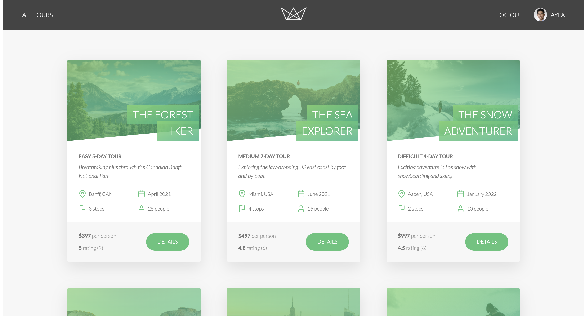

# Natours Application

> The Natours App is a network of communities based on people's interests, and similar to Reddit.

## Table of contents

- [General info](#general-info)
- [Screenshots](#screenshots)
- [Technologies](#technologies)
- [Setup](#setup)
- [Features](#features)
- [Status](#status)
- [Inspiration](#inspiration)
- [Contact](#contact)

## General info

The Natours App is a tours app, where users can browse and book tours.

## Screenshots

## Technologies

- mongoose - version 5.9
- node - version 12.0
- Javascript - ES6
- Stripe - version 8.68

## Setup

\$ npm install

## Code Examples

Show examples of usage:
`const path = require('path'); const express = require('express'); const morgan = require('morgan'); const rateLimit = require('express-rate-limit'); const helmet = require('helmet'); const mongoSanitiza = require('express-mongo-sanitize'); const xss = require('xss-clean'); const hpp = require('hpp'); const cookieParser = require('cookie-parser'); const compression = require('compression'); const cors = require('cors');`

## Features

List of features ready and TODOs for future development

- View all tours
- View tour details
- Book tour

To-do list:

- Sign up form
- Create review

## Status

Project is: _in progress_, and will add more amazing features

## Inspiration

Add here credits. Project inspired by Jonas Schmedtmann, created on his course: "Node.js, Express, MongoDB & More: The Complete Bootcamp 2020".

## Contact

Created by [@Eva](https://www.facebook.com/profile.php?id=100042321316185) - feel free to contact me!
